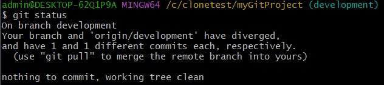

# Git 사내세미나
## - Table of Contents -

1. 깃 플로우란?
2. 기본 명령어 정리
3. 테스트케이스
 3-1. 충돌상황
 3-2. 실수로 다른 브랜치에서 작업
 3-3. 실수로 작업중인 브랜치를 삭제
 3-4. 작업 브랜치에 최신 브랜치 내용 반영

---

# 깃 플로우란?

- 깃을 어떻게 사용할지에 대한 표준화된 방식
- 효율적인 브랜치 관리를 위한 전략

# 브랜치 관리가 필요한 경우?
- 프로젝트 규모가 커지고 팀원이 늘어났을 경우
- 버전관리의 중요성이 높고 히스토리 관리가 필수인 경우


---

# git flow branch
- master : 제품 배포를 위한 기준이 되는 브랜치
- develop : 개발자들이 작업한 기능을 병합하는 브랜치
- feature 브랜치 : 새로운 기능이나 개선사항을 작업하는 브랜치, 개발 브랜치에서 분기
- release 브랜치 : 품질검사를 거친 후 마스터 브랜치에 병합되기 전의 브랜치. 개발 브랜치에서 분기
- hotfix 브랜치 : 긴급한 버그 수정을 위해 마스터 브랜치에서 분기

---

# Atlassian Git flow


---

# Compassion Git flow


---

# Fork


---

# Git Basic Command

## 1. git clone <git clone url>
- 원격 저장소의 내용을 로컬 저장소로 복사
- 최초 커밋 기록 없이도 다른 브랜치를 만들 수 있음
## 2. git init
- 로컬 저장소를 생성
- 원격 저장소와 연결하려면 'remote add <url>' 명령어를 사용

---

## 3. 원격 브랜치와 연결
- 로컬 저장소의 브랜치와 연결된 원격 저장소 확인
```
git branch -vv
```
- 모든 로컬 및 원격 브랜치 확인
```
git branch -a
```
- 원격 브랜치에 푸시하고 연결 설정
```
git push -u origin <원격브랜치명>

git branch --set-upstream-to=<원격브랜치명> <로컬브랜치명>

git checkout -b <로컬브랜치명> --track <원격브랜치명>

git checkout -t <원격브랜치명>
```

---

## 4. git add , git commit


---

## 5. git merge


---

## 6. git rebase


---

## 8. git reset


---


## 9. git revert
- 지정된 커밋의 변경 내용을 취소하는 새 커밋 생성 (이미 push한 경우 사용)


## 10. git tag
- 사용자 지정 이름으로 커밋 해시를 참조할 수 있게 함
- 릴리스 관리, 브랜칭, 변경 사항 비교 등에 유용

---

## 11. git stash
- 아직 커밋하지 않은 변경 내용을 일시적으로 저장


---

## 12. git push


---

## 13. git pull
- git fetch와 git merge의 조합으로 원격 저장소의 변경 사항을 가져와 병합


---

## 14. git fetch
- 원격 저장소의 내용을 가져오고, 수동으로 병합
- fast-forward 병합 시 커밋 기록을 남기지 않으려면 --ff-only 옵션 사용

---
#  다양한 충돌상황 : 동일한 파일에서 충돌하는 간단한 변경 사항 


---

- development 브랜치에서 따온 각 feature 브랜치를 merge할 때
(1) 각 feature branch 생성 후 작업 진행
 
(2) feature1 branch add and commit
 

---

 (3) feature1 branch add and commit, feature2 동일한 작업.
 
 (4) developmet 브랜치 이동후 merge
 

---

(5)충돌사항 변경

(6)add-commit-push


---
(7)깃히스토리 확인

(8)feature 브랜치 삭제
git branch -d feature1, feature2

---

- development 브랜치에서 push전에 pull로 땡겨올 떄


---

(1) 작업 후 push전 diverged 메세지 확인.


---

(2) fetch or pull


---
(3)충돌사항 변경

(4)add-commit-push


---
# 2. 여러 파일에서 충돌하는 변경 사항
(1)충돌 리스트 확인


(2)충돌사항 변경


---

(3)add-commit-push


(4)history


---
# 3. 파일 구조의 충돌 변경


---

(1)fetch를 해서 merge 하기.


---

# 4. 바이너리 파일의 충돌 변경
(1)이미지 바이너리 파일 변경시 수동으로 체크해줘야 함


---

(2)이미지 비교도구나 바이너리 비교 등 소통을 통해서 수정 후 코드에 반영
(3)add-commit-push
(4)history


---

# 5. 여러 커밋포인트의 충돌
## 5-1. Rebase 서로 다른 커밋 기록을 가진 두 개의 분기의 충돌


---

- Rebase의 2개의 커밋 포인트가 모두 충돌날 경우
(1)rebase 충돌메세지와 충돌 개수 표시


---

(2)충돌 해결 후 add 후 rebase --continue로 진행

(3)충돌 해결 후 add 후 rebase --continue로 진행

(4)merge 후 feature 브랜치 삭제

---

## 5-2. 다른 커밋 기록을 가진 두 개의 분기의 중 하나의 분기에서 cherry-pick 시 충돌


---

(1)cherrypick시 충돌 오류 메세지


---

(2)충돌 해결 후 add 후 cherrypick --continue로 진행


---

# 실수로 다른 브랜치에서 작업했을 경우

1. push를 하지 않았을 경우
```
git reset
```
2. Push했지만 커밋 기록을 남기고 싶을 경우
```
git revert
git revert HEAD~2^..HEAD
```
3. Push했으나 커밋 기록을 남기지 않고 싶을 경우
```shell
1. git revert --no-commit <commit_to_revert>
2. git add 
3. git commit --amend --no-edit
4. git push -f origin master
```

---

- push까진 안했을 경우
(1)feature에서 작업해야하는데 dev에서 작업함.
 
(2)mixed 옵션으로 리셋을 함.(작업디렉토리를 살림)
 

---

(3)stash를 통해서 저장 후 
hard리셋 후 브랜치 이동 후 stash에서 작업내용을 다시 가져옴


---

 ● push까지 한 경우 

---

(1) git revert 를 사용해서 취소커밋 만들기 -> push


---

● 기록을 남기고 싶지 않은 경우


---

# 실수로 작업중인 브랜치를 삭제

1. topic 브랜치를 삭제했을 경우
```
git branch -D topic
```
2. 삭제된 로그의 고유값
```
git reflog 
```
3.  롤백 수행.
```
git checkout -b topic <고유값>
```

---

(1)feature 브랜치에서 커밋까지 한 상태


(2)실수로 브랜치 삭제


---

(3)해당 브랜치의 고유값을 통해 롤백 수행.


---

#  작업 브랜치에 최신 브랜치 내용 반영

1. merge

- 병합 후 새로운 커밋이 추가되어 브랜치가 분기

2. rebase
- 새로운 커밋이 추가되고 선형적인 커밋 기록이 유지

3. cherry-pick
- 메인 브랜치의 특정 커밋을 기능 브랜치에 적용
- 특정 변경 사항만을 통합

---

(1) merge case  : 기능 브랜치에 병합 
