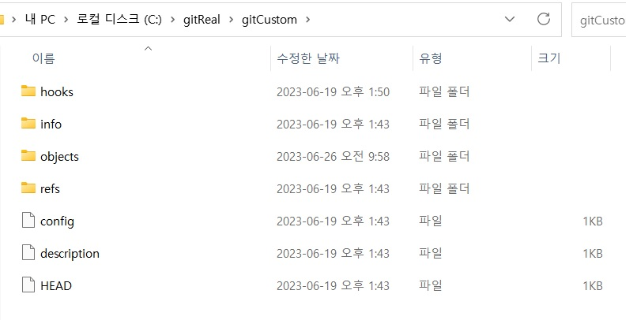

# Git 실습 시나리오

1. Merge Strategy
2. 편지함 선반영 문제 (함께실습)
3. 강제 push 막기 (혼자서진행)

---

# Merge Strategy
- Fast-forward merge
- 之 , mergeCommit
- squashMerge

---

# Fast-forward merge


---

# 之 , mergeCommit


---

# squashMerge


---

# Bitbucket Merge Strategy(ff 불가능)


---

## 어떤게 좋을까요? (토론)

---


# 편지함 선반영 문제


---

# 시나리오
- Api 건에 대해서 PR요청으로 처리
- 중간 관리자 승인


---


---


---


---


---

```
Fast-Forward 병합은 소스 브랜치가 목적지 브랜치의 직접적인 후속 커밋일 경우에만 가능합니다. 즉, 목적지 브랜치에서 추가적인 커밋이 없고, 소스 브랜치가 목적지 브랜치로부터 분기된 이후에만 커밋이 추가된 경우에 가능한 병합 방법입니다. 이 때 소스 브랜치의 커밋들을 목적지 브랜치가 단순히 추적하는 것이라고 볼 수 있습니다.

하지만 목적지 브랜치에 소스 브랜치와 충돌하는 변경사항이 있다면, 이는 소스 브랜치가 분기된 이후 목적지 브랜치에도 변경사항이 추가된 것을 의미하며, 이 경우 Fast-Forward 병합은 불가능하게 됩니다. 이 때는 일반 병합(Merge Commit)이나 Squash 병합을 사용하여 병합을 진행해야 합니다.
```


---


---

## 강제 Push 보호전략

# 1. Server-side Hooks 사용
# 2. GitHub, Bitbucket protected branch 설정

---

## protected branch 설정


---

## 강제 push, 강제 삭제 실패


---

## Server-side Hooks

```
#!/bin/bash

# 'pre-receive' 훅은 stdin으로 'oldrev newrev refname' 형태의 라인을 읽습니다.
while read oldrev newrev refname; do
  # 만약 oldrev가 0{40} (즉, 이 해시값은 이전커밋이 없음을 나타내며= 새로운 브랜치)이면 건너뜁니다. 새로운 브랜치는 어떤 이전 커밋을 덮어쓰지 않기 때문이다.
  if [[ $oldrev == 0000000000000000000000000000000000000000 ]]; then
    continue
  fi

#$newrev 커밋이 $oldrev 커밋의 후속 커밋인지 확인
  if ! git rev-list $oldrev..$newrev | 
     grep --quiet $(git rev-list $newrev^..$oldrev); then
      echo "Force push detected on $refname. Denying push."
      exit 1
  fi
done

```

---

## local Hosting Git Server (원격저장소로 사용)
```
$ git init --bare
Initialized empty Git repository in /path/to/repository.git/
```


---

## Server-side Hooks Scenario

1. a branch : forceTest.txt 수정 후 origin/a로 push
2. b bracnh : forceTest.txt 수정 후 origin/a로 강제 push
3. Deny 발생
